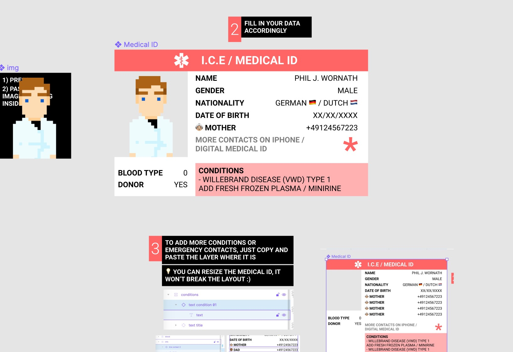

# 🏥🆔 Medical ID Template

This year I got a diagnosis and my doctor issued a medical ID - but it was handwritten and in German. I was really afraid of what would happen if I was abroad and the doctor had no idea what it said.

## Research for ICE / Medical ID templates

I was looking for Medical IDs / ICE (In Case of Emergency) - templates that look pleasling, official and are easy to fill in. After some research I decided to create my own - and now you can use it as well.

Just duplicate the Figma file and use it for your very personal Medical ID

## Features:

- Easy to drag and drop ID picture
- Responsive layout
- Add as many conditions / emergency contacts as you like, the document is flexible

[🏥🆔 Medical ID Figma template](https://www.figma.com/file/Y7EQF7fdC1tIhQESHPVlLF/Medical-ID-%F0%9F%8F%A5%F0%9F%86%94-Duplicate-to-your-Account-%E2%9E%A1%EF%B8%8F?node-id=0%3A1)
